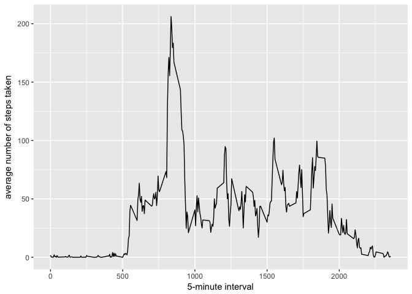

# Reproducible Research
Ashish Sood  
7/10/2017  


# Load the data

```r
setwd("/Users/ashisood/Documents/personal/courses/datasciencecoursera/reproducible research/week2")
if(!file.exists('activity.csv')){
    unzip('activity.zip')
}
activity <- tbl_df(read.csv("activity.csv"))
glimpse(activity)
```

```
## Observations: 17,568
## Variables: 3
## $ steps    <int> NA, NA, NA, NA, NA, NA, NA, NA, NA, NA, NA, NA, NA, N...
## $ date     <fctr> 2012-10-01, 2012-10-01, 2012-10-01, 2012-10-01, 2012...
## $ interval <int> 0, 5, 10, 15, 20, 25, 30, 35, 40, 45, 50, 55, 100, 10...
```

# What is mean total number of steps taken per day?

```r
total_steps_per_day <-
        activity %>%
        group_by(date) %>%
        summarise(sum(steps, na.rm = TRUE))
names(total_steps_per_day)<-c("date", "total.steps")
glimpse(total_steps_per_day)
```

```
## Observations: 61
## Variables: 2
## $ date        <fctr> 2012-10-01, 2012-10-02, 2012-10-03, 2012-10-04, 2...
## $ total.steps <int> 0, 126, 11352, 12116, 13294, 15420, 11015, 0, 1281...
```

1. Make a histogram of the total number of steps taken each day

```r
ggplot(total_steps_per_day, aes(x=total.steps)) +
        geom_histogram(binwidth = 500) + ylab("steps taken per day with binwidth = 500")
```

<!-- -->

2. Calculate and report the mean and median total number of steps taken per day

```r
Mean = mean(total_steps_per_day$total.steps, na.rm = TRUE)
Median = median(total_steps_per_day$total.steps, na.rm = TRUE)
```
- Mean = 9354.2295082
- Median = 10395

# What is the average daily activity pattern?


```r
total_steps_per_day_ts <-
        activity %>%
        group_by(interval) %>%
        summarise((avg = mean(steps, na.rm = TRUE)))


names(total_steps_per_day_ts)<-c("interval", "mean.steps.ts")
ggplot(data=total_steps_per_day_ts, aes(x=interval, y=mean.steps.ts)) +
        geom_line() +
        xlab("5-minute interval") +
        ylab("average number of steps taken") 
```

<!-- -->

1. Which 5-minute interval, on average across all the days in the dataset, contains the maximum number of steps?

```r
max_interval <- total_steps_per_day_ts[which.max(total_steps_per_day_ts$mean.steps.ts),]$interval
most_steps <- gsub("([0-9]{1,2})([0-9]{2})","\\1:\\2",max_interval)
```
Most Step at 8:35 interval

# Imputing missing values
1. Calculate and report the total number of missing values in the dataset (i.e. the total number of rows with 𝙽𝙰s)

```r
na_value<-sum(is.na(activity$steps))
```
Missing Values in data set = 2304

2. Imputing Missing values in the dataset. Use mean of 5 minute interval for imputing the value

```r
imp_activity<-activity
for (tmp_interval in unique(activity$interval) ) {
        # index of missing values for a interval
        na_interval_index<-which(imp_activity$interval==tmp_interval & is.na(imp_activity$steps))
        # assign mean steps during that interval as the new value.
        imp_activity[na_interval_index,]$steps = 
                total_steps_per_day_ts[total_steps_per_day_ts$interval==
                                               tmp_interval,]$mean.steps.ts
        
}
```

3. Make a histogram of the total number of steps taken each day

```r
tmp_total_steps_per_day <-
        imp_activity %>%
        group_by(date) %>%
        summarise(sum(steps, na.rm = TRUE))
names(tmp_total_steps_per_day)<-c("date", "total.steps")

glimpse(tmp_total_steps_per_day)
```

```
## Observations: 61
## Variables: 2
## $ date        <fctr> 2012-10-01, 2012-10-02, 2012-10-03, 2012-10-04, 2...
## $ total.steps <dbl> 10766.19, 126.00, 11352.00, 12116.00, 13294.00, 15...
```

```r
ggplot(tmp_total_steps_per_day, aes(x=total.steps)) +
        geom_histogram(binwidth = 500) + ylab("steps taken per day with binwidth = 500")
```

<!-- -->

4. Calculate and report the mean and median total number of steps taken per day


```r
tmp_Mean<-mean(tmp_total_steps_per_day$total.steps, na.rm = TRUE)
tmp_Median<-median(tmp_total_steps_per_day$total.steps, na.rm = TRUE)
```
- Mean = 1.0766189\times 10^{4}
- Median = 1.0766189\times 10^{4}

5. Analysis of difference between the Activities on weekdays and weekends
The day of the week was assigned to each date, and then a new factor variable created with two levels, “weekday” and “weekend”, indicating whether a given date is a weekday or a weekend day.


```r
imp_activity$week<-
        ifelse(weekdays(as.Date(imp_activity$date)) %in% 
                       c("Saturday", "Sunday"), "weekend", "weekday")
glimpse(imp_activity)
```

```
## Observations: 17,568
## Variables: 4
## $ steps    <dbl> 1.7169811, 0.3396226, 0.1320755, 0.1509434, 0.0754717...
## $ date     <fctr> 2012-10-01, 2012-10-01, 2012-10-01, 2012-10-01, 2012...
## $ interval <int> 0, 5, 10, 15, 20, 25, 30, 35, 40, 45, 50, 55, 100, 10...
## $ week     <chr> "weekday", "weekday", "weekday", "weekday", "weekday"...
```

Show a panel plot of the time series of the average number of steps taken, averaged across all weekday days or weekend days, versus the time interval

```r
new_mean_steps_per_day_ts <-
        imp_activity %>%
        group_by(interval, week) %>%
        summarise((avg = mean(steps, na.rm = TRUE)))
names(new_mean_steps_per_day_ts)<-c("interval", "week", "mean.steps.day.ts")
ggplot(data=new_mean_steps_per_day_ts, aes(x=interval, y=mean.steps.day.ts)) +
        geom_line() +
        facet_grid(week ~ .) +
        xlab("5-minute interval") +
        ylab("average number of steps taken")
```

<!-- -->
